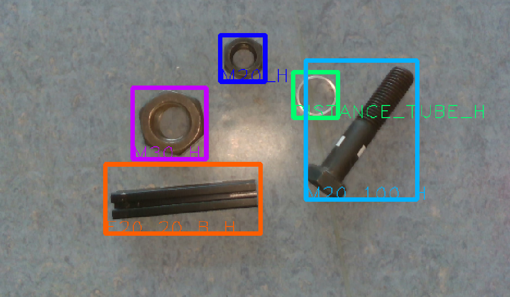

# Vision - Mission

This project contains a [dataset to detect objects](https://ificloud.xsitepool.tu-freiberg.de/index.php/s/gYbsyaCX8MqW45o/download) and evaluation code.

## Object Detection Dataset

* images captured from a camera mounted on the robots arm during [BTT](https://www.youtube.com/watch?v=qoQVruwKd7k), [PPT](https://www.youtube.com/watch?v=HfWjK-29w4A) and [RTT](https://www.youtube.com/watch?v=UigqNKzv6WU) runs
* with bounding box annotations of atwork and rockin objects, as well as ppt-cavities and containers (https://atwork.robocup.org/wp-content/uploads/2019/02/Rulebook_2019.pdf#subsection.3.5.3)

Data is split into:
* 3 directories (train, test, val)
* each containing a 'coco_annotations.json' with object detection annotations following [CoCo](http://cocodataset.org/#format-data)

## Detection Results

* Json file containing a list of elements
* each element contains the 'image_id' to which the detection belongs, 'category_id' of the detected class with a score (probability in [0, 1] expressing the detections confidence) and the 'bbox' (list of four numbers: [x, y, width, height] with 'x', 'width' along the image's horizontal axis and 'y', 'height' along the vertical)
* see example_results/detections.json as reference

## Evaluation

* 'evaluate_detections.py' takes a groundtruth coco_annotations.json and a prediction.json (similar to data/example_results/detection.json) and calculates the mean-Average-Precision as evaluation
